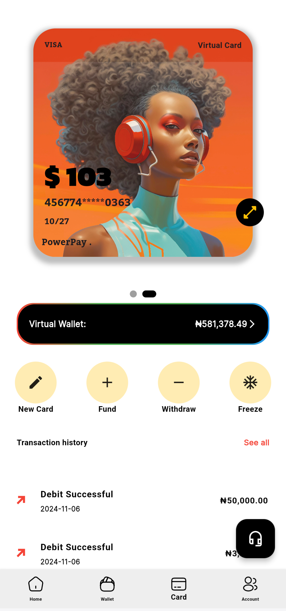

# PowerPay 💳💼

PowerPay is a fintech solution designed to provide users with **virtual cards** for seamless and secure online transactions. It solves the problem of international payment limitations faced by users in Nigeria by offering **secure, flexible, and user-friendly** payment options.

## 🚀 Features
- **Virtual Card Issuing**: Enables users to generate virtual cards for online transactions.
- **Virtual Wallet Management**: A **custom virtual wallet** built with Firebase Firestore, allowing users to:
  - Fund their wallets via Local bank transfer(Fund transfer).
  - Track wallet balances in real-time.
  - Use wallet balances for transactions with virtual cards.
- **Secure Payment Flows**: Integration with **Flutterwave** and **Paystack** for reliable payment processing.
- **Discount Code System**: Users can apply coupon codes for discounts with expiration and usage limits.
- **Progressive Reward System**: Encourages user engagement with rewards for completing specific actions.
- **KYC Verification**: Includes **BVN**, **NIN**, and **ID card uploads** for compliance.
- **Retry Mechanism**: Ensures reliable operations in case of network interruptions.
- **Timer Persistence**: Tracks and restores user actions even after app restarts.
- **Firebase Integration**: Used for database management, authentication, and remote configuration.

---

## 🛠️ Technologies Used
- **Frontend**: Flutter (Dart)
- **Backend**: Firebase (Firestore, Functions, Remote Config)
- **Payment Integration**: Flutterwave, Paystack APIs
- **Tracking**: Google Analytics, Postback URLs

---

## 📸 Screenshots
### App Overview



---

## 🧰 Getting Started

### Prerequisites
- Flutter SDK installed ([Download Flutter](https://docs.flutter.dev/get-started/install))
- Firebase account for backend setup
- API keys for Flutterwave and Paystack

### Installation
1. Clone the repository:
   ```bash
   git clone https://github.com/ejioforaustine/powerpay.git


🧩 Project Highlights
Virtual Wallet with Firestore:
  Each user has a dedicated wallet stored in Firestore under their account.
  The wallet supports real-time updates for balance and transaction history.
  Wallet balances are used to fund virtual card transactions securely.
Secure Payment Verification: 
  Server-side logic ensures payment authenticity before processing transactions.
Scalable Architecture: 
  Database structure in Firestore is optimized for user growth and feature expansion.
Responsive UI:
  Built with Flutter, ensuring smooth performance on both Android and iOS devices.
Dynamic Features: 
  Timer persistence, discount code logic, and user-specific limits are implemented using Firebase Remote Config.

📜 License
This project is licensed under the MIT License. See the LICENSE file for details.

📬 Contact
If you have any questions or want to discuss the project:

Email: ejioforchiagozie@gmail.com
Phone: +234-7033005327
GitHub: https://github.com/ejioforaustine

  
